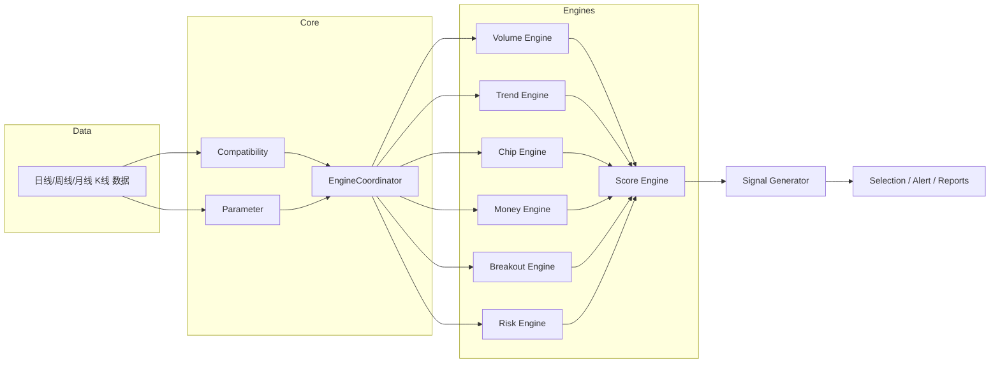

"""
系统架构：第一卷 - 文档

包含：
- 模块划分
- 模块接口与输入输出说明
- 数据流与 Mermaid 图
- 文件目录草案

作者：首席量化架构师
"""

# 目录

- Core/：核心调度与通用工具
- Score/：评分引擎聚合与权重配置
- Trend/：趋势评分模块
- Volume/：成交量评分模块
- Chip/：筹码（持仓分布）模块（真实/近似）
- Money/：资金行为识别模块
- Breakout/：突破识别模块
- Risk/：风险识别与扣分模块
- Signal/：信号生成与策略入口
- Filter/：条件筛选与选股逻辑
- Parameter/：参数管理与导入导出
- Debug/：调试工具与日志
- Compatibility/：同花顺兼容层（WINNER/COST/FINANCE 适配）
- Selection/：选股公式与导出
- Alert/：预警规则与公式
- Test/：单元测试与回归测试
- Documentation/：自动生成文档与手册

模块职责说明（高层）：

1. Compatibility
   - 负责同花顺内置函数的检测与兼容适配。
   - 如果 WINNER() / COST() / FINANCE() 等不可用，自动切换近似算法或跳过但不报错。
   - 提供统一接口给上层引擎调用：get_winner(), get_cost(), get_finance()。

2. Parameter
   - 集中管理所有参数，支持默认参数、用户参数、快速恢复默认值。
   - 参数存储采用 YAML/JSON，支持版本化。
   - 对外提供参数读取、校验、导入导出接口。

3. Volume
   - 计算成交量相关特征并输出 0~25 分评分。
   - 特征包括：持续缩量/放量、倍量、天量/地量、量比、量能斜率、量能变化率、量能百分位、量价背离、缩量上涨、放量突破、缩量洗盘、放量出货。
   - 输出结构：{score: float, details: {metric: value, ...}}

4. Trend
   - 自动支持 MA/EMA/EXPMA 算法切换。
   - 评估均线方向、均线角度、均线发散/粘合、均线突破、均线修复、趋势持续性。
   - 输出 0~20 分评分与细节。

5. Chip
   - 优先调用 Compatibility 层获取真实筹码（WINNER/COST）。若不可用，使用近似算法（平台宽度、ATR、振幅、换手率、连续缩量、筹码锁定模拟）。
   - 输出 0~15 分评分。

6. Money
   - 不依赖 L2，通过成交额、换手率、K线形态（实体、上下影、连续阳线/阴线）推导资金行为（吸筹/试盘/洗盘/拉升/派发/诱空/诱多）。
   - 输出 0~15 分评分。

7. Breakout
   - 识别各类突破（平台/箱体/三角/圆弧/旗形/假突破/确认/失败）。
   - 输出 0~10 分评分与确认标志位。

8. Risk
   - 识别并扣分：高位放量、长上影、连续涨停、跳空高开、均线死叉、MACD 背离、RSI 超买、ATR 异常、跌破平台等。
   - 输出扣分项与 0~15 分风险扣分（越低风险越高分）。

9. Score
   - 聚合所有子模块得分，按可配置权重计算总分（默认 100 分制）。
   - 提供评分阈值配置（默认 80 以上进入选股）。

10. Signal/Selection/Alert
   - 基于评分与规则生成主图箭头、选股清单与预警公式。
   - 提供导出同花顺公式文本与 Python 回测用 CSV。

模块接口示例（Python）

- 每个模块实现统一基类：BaseEngine
  - 输入：k-line 数据（DataFrame，包含 date/open/high/low/close/volume/turnover）
  - 参数：dict（从 Parameter 引擎注入）
  - 输出：{score: float, max_score: float, details: dict}

数据流（高层）

kline -> Compatibility (必要时) -> Parameter -> 各 Engine 并行计算 -> Score 聚合 -> Signal 生成 -> 输出/日志/预警

Mermaid 模块关系图：



文件/目录草案：

```
ths-xgcl/
├─ README.md
├─ LICENSE
├─ pyproject.toml
├─ config/parameters.yaml
├─ core/
│  ├─ __init__.py
│  ├─ engine.py
│  └─ compatibility.py
├─ volume/
│  └─ volume_engine.py
├─ trend/
│  └─ trend_engine.py
├─ chip/
│  └─ chip_engine.py
├─ money/
│  └─ money_engine.py
├─ breakout/
│  └─ breakout_engine.py
├─ risk/
│  └─ risk_engine.py
├─ score/
│  └─ score_engine.py
├─ signal/
│  └─ signal.py
├─ tests/
│  └─ test_volume.py
└─ docs/
   └─ architecture.md
```

参数版本控制与变更记录：
- 参数文件采用 YAML，放置于 config/ 下，文件名包含版本号（如 parameters_v1.yaml）。
- 每次自动优化或校准后，写入新的参数文件并在 logs/ 中记录变更。

代码规范（摘要）：
- 全中文注释，命名统一（驼峰或下划线样式统一采用 snake_case）。
- 禁止重复计算与硬编码，所有常量放入配置或常量模块。
- 单元测试覆盖正常输入、边界值、异常输入与空数据。

